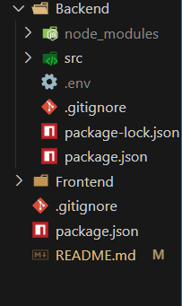

# 🚀 Project Title

> A one-line tagline or mission statement for your project.

---

## 📌 Problem Statement

**Using Groq Only -**
**Develop a real-time language translation app that uses Groq to process text and audio inputs, providing seamless multilingual communication for travelers or remote teams.**

---

## 🎯 Objective

Enables real-time communication between users who speak different native languages, effectively eliminating language barriers and enhancing workflow efficiency."

---

## 🧠 Team & Approach

### Team Name:  
`Solo Participant`

### Team Members:  
- Krish Kumar 

### Links: 
 Github-https://github.com/KrishK22/GroqChatAi
 LinkedIn-https://www.linkedin.com/posts/krish-kumar-a6214730a_hackhazards-hackhazards2025-innovationinaction-activity-7315800102932017153-FYd4?utm_source=share&utm_medium=member_desktop&rcm=ACoAAE6v5SoBlkjBoZCxAoZa4AS98QvrZC7gqWQ
 X/Twitter-https://x.com/krishku06/status/1910718961647313266

### Approach:  
- I chose this problem statement as it aligned with my prior experience and offered an exciting challenge—integrating dynamic language translation using the Groq API for the first time.
- A major pivot came when redesigning the message flow to ensure translations passed through Groq before being stored. Brainstorming also led to improved prompt structures and optimizations in real-time communication for better performance.


### challenges I faced 
- Crafting effective prompts to ensure accurate and consistent responses from the Groq API was a significant challenge.
- Navigating the Groq documentation and understanding its implementation, especially as it was my first time integrating AI into a project.
- Building a robust real-time communication system posed architectural and technical hurdles.
- Optimizing frontend performance, particularly managing and minimizing unnecessary re-renders, required careful state management.
- Designing an efficient database schema was also a key challenge—I needed the translated messages to be processed through Groq before being stored, which added complexity to the data flow.


---

## 🛠️ Tech Stack

### Core Technologies Used:
- Frontend: React
- Backend: Nodejs
- Database: MongoDb
- APIs: Express , Socketio


### Sponsor Technologies Used (if any):
- [ ] **Groq:** Used Groq to translate messages into the user's selected native language, enabling seamless multilingual communication.
---

## ✨ Key Features

- ✅ real time communication with translated messages 

---

## 📽️ Demo & Deliverables

- **Demo Video Link:** https://drive.google.com/file/d/1DSmUtFCv_3d2vhs44nMcDpY9hcDRVNl6/view?usp=sharing

---

## ✅ Tasks & Bonus Checklist

- [ ] **All members of the team completed the mandatory task - Followed at least 2 of our social channels and filled the form** ✅ 
- [ ] **All members of the team completed Bonus Task 1 - Sharing of Badges and filled the form (2 points)**  ✅
- [ ] **All members of the team completed Bonus Task 2 - Signing up for Sprint.dev and filled the form (3 points)** ✅


---

## 🧪 How to Run the Project

### Requirements:
- Node.js 
- API Keys (if any)
- .env file setup 
    PORT=3000
    JWT_SECRET=groqchatapp124
    MONGODB_URI=mongodb://localhost:27017/GroqChatAi
    CLOUDINARY_CLOUD_NAME=dqltvkb0y
    CLOUDINARY_API_KEY=396575495639882
    CLOUDINARY_API_SECRET=5H7dZVn0yA5TM90B_5tn-mlyJMo
    GROQ_API_KEY = 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
    GROK_API_NAME = test

### Local Setup:
```bash
# Clone the repo
git clone https://github.com/KrishK22/GroqChatAi.git

# Install dependencies in both frontend and backend 
cd backend 
npm install

cd frontend
npm install

# Start backend server

cd backend
npm run dev

#Start Frontend 

cd frontend
npm run dev
```

.env should be in root directory of backend folder


---

## 🧬 Future Scope

List improvements, extensions, or follow-up features:

- 📈 More integrations  
- 🛡️ Security enhancements  
- 🌐 Localization / broader accessibility  

---

## 📎 Resources / Credits

- APIs or datasets used  
- Open source libraries or tools referenced  
- Acknowledgements  

---

## 🏁 Final Words

Share your hackathon journey — challenges, learnings, fun moments, or shout-outs!

---